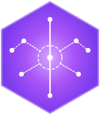

<p align="center">
  
</p>

# Synapse: Elixir-Powered AI Agent Orchestration

[](https://hex.pm/packages/synapse_core)
[](https://github.com/nshkrdotcom/synapse/blob/main/LICENSE)

## Overview

**Synapse** is a robust and scalable AI agent orchestration framework built on the power of Elixir and the BEAM VM. It leverages the strengths of **Erlang/OTP** for concurrency, fault tolerance, and distributed computing to manage and coordinate a network of AI agents. While providing first-class integration with Python, Synapse is designed to support polyglot architectures, empowering developers to build sophisticated, multi-agent systems that harness the best of both worlds.

Synapse draws inspiration from `pydantic-ai`, a Python library that combines the structured data validation of Pydantic with the dynamic capabilities of LLMs. However, Synapse is not merely a port; it's a reimagining of agent orchestration in the context of Elixir's unique capabilities.

## Core Principles

*   **Elixir-First Orchestration:** Elixir's OTP principles (supervision trees, GenServers, message passing) form the foundation of Synapse's agent management.
*   **Polyglot Design:** Seamlessly integrate Python agents (built with `pydantic-ai` or other frameworks) and potentially other languages, taking advantage of their specific strengths.
*   **Scalability and Fault Tolerance:** Leverage the BEAM VM's inherent capabilities to build systems that can scale effortlessly and gracefully handle failures.
*   **Developer Ergonomics:** Provide a clean, Elixir-idiomatic API for defining, managing, and interacting with agents.
*   **Extensibility:** Allow for the integration of various LLMs, vector databases, and other AI tools through a modular architecture.
*   **Observability:** Offer robust monitoring, logging, and tracing capabilities to understand the behavior of complex agent interactions.

## Installation

The package can be installed by adding `synapse_core` to your list of dependencies in `mix.exs`:

```elixir
def deps do
  [
    {:synapse_core, "~> 0.1.0"}
  ]
end
```

## Usage (Conceptual Examples)

**Defining an Agent Workflow in Elixir:**

```elixir
# lib/my_app/agent_workflow.ex

defmodule MyApp.AgentWorkflow do
  use Synapse.Workflow

  agent(:python_agent_1, 
      module: "python_agent_1", 
      model: "openai:gpt-4o",
      system_prompt: "You are a helpful assistant that translates English to French.",
    tools: [
        %{
        name: "some_tool",
        description: "A simple tool that takes a string and an integer as input.",
        parameters: %{
            "type" => "object",
            "properties" => %{
            "arg1" => %{"type" => "string"},
            "arg2" => %{"type" => "integer"}
            },
            "required" => ["arg1", "arg2"]  # If both are required
        },
        handler: {:python, module: "example_agent", function: "some_tool"}
        }
    ],
      result_type: %{
        translation: :string
      },
      retries: 3
      )

  agent(:python_agent_2,
    module: "python_agent_2",
    model: "gemini-1.5-flash",
    system_prompt: "You are a summarization expert.",
    deps: %{api_key: "your_gemini_api_key"} # Example of passing dependencies
  )

  # Define connections/message routing between agents
  flow do
    python_agent_1 |> python_agent_2
  end
end
```

**Interacting with Agents via the Phoenix API:**

```bash
# Send a request to `python_agent_1`
curl -X POST http://localhost:4000/agents/python_agent_1/run_sync \
  -H "Content-Type: application/json" \
  -d '{"prompt": "Hello, how are you?"}'

# Example response
# {"status": "success", "result": {"translation": "Bonjour, comment ça va?"}, "usage": {...}}
```

**Example `pydantic-ai` Agent in Python:**

```python
# apps/synapse_python/lib/synapse_python/agents/python_agent_1.py
from pydantic import BaseModel
from pydantic_ai import Agent

class Input(BaseModel):
    prompt: str

class Output(BaseModel):
    translation: str

agent = Agent(
    model="openai:gpt-4o",  # Or read from environment variable set by Elixir
    result_type=Output,
    system_prompt="You are a helpful assistant that translates English to French.",
)
```

## Key Features and Considerations

*   **HTTP-Based Communication:** Initially using HTTP with JSON for simplicity and ease of debugging.
*   **Pydantic-AI Integration:** Leverages the power of `pydantic-ai` for agent definition and LLM interaction on the Python side.
*   **Elixir/OTP for Orchestration:** Utilizes Elixir's concurrency model and OTP principles for robust agent management.
*   **Agent Lifecycle Management:** Elixir supervisors handle starting, stopping, and restarting Python agent processes.
*   **Message Routing:** Elixir orchestrates the flow of messages between agents based on a defined workflow.
*   **Configuration from Elixir:** All agent configuration is managed by Elixir and passed to the Python side.
*   **Schema Validation:** Uses JSON Schema (or a similar mechanism) to define input/output schemas for agents and perform validation.
*   **Extensible Design:** Allows for future integration of other LLMs, tools, and communication protocols (e.g., gRPC).
*   **Streaming Support:** Designed with streaming in mind, although the initial implementation might use polling for simplicity.

## Why "Synapse"?

The name "Synapse" combines the "Ax" from "Elixir" with "on" to signify agents that are "on" and connected. It also evokes the biological synapse, which transmits signals in a neural network, reflecting the framework's role in connecting and orchestrating AI agents.

## Conclusion

Synapse aims to be a unique and powerful addition to the AI ecosystem, combining the strengths of Elixir/OTP with the flexibility and rich ecosystem of Python and `pydantic-ai`. This README provides a starting point for the project, outlining the core concepts, structure, and initial design choices. As development progresses, the design and implementation details will be further refined. We will prioritize a simple and robust HTTP-based integration, allowing us to deliver a functional system quickly while keeping our options open for future performance optimizations and advanced features.
