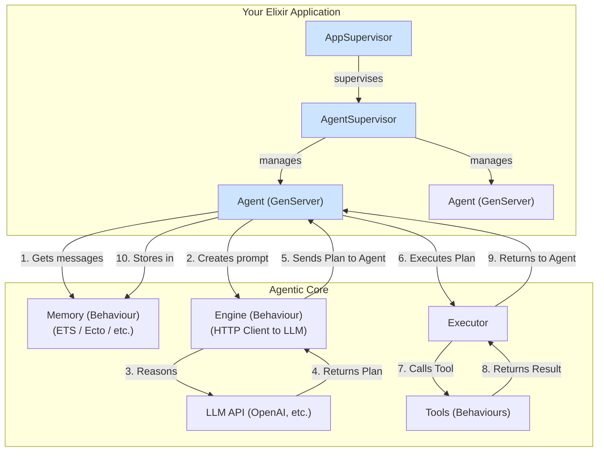

### Core Philosophy

1.  **Elixir is the Orchestrator:** The framework's heart is pure Elixir/OTP. Agents are `GenServer` processes, providing state management, concurrency, and fault tolerance out of the box.
2.  **Tools are Just Modules:** Agent capabilities ("tools") are simple Elixir modules that adhere to a specific `behaviour`. This makes them easy to create, test, and reuse.
3.  **The "Brain" is Pluggable:** The reasoning engine (the LLM) is abstracted behind a `behaviour`. This decouples the agent's logic from any specific AI provider (like OpenAI, Anthropic, or a local model). The default implementation simply makes an HTTP call.
4.  **Memory is Pluggable:** An agent's memory (its history of messages and actions) is also managed through a `behaviour`, allowing developers to easily swap between in-memory, ETS, or persistent database backends.

---

### High-Level Architecture

The framework consists of a few key, composable components that work together within a supervised OTP application.



---

### Core Components Explained

#### 1. The Agent (`Agent.Server`)

This is the central, stateful entity. Each agent is a `GenServer` that orchestrates the entire process.

*   **State:** Holds the agent's ID, configuration (name, instructions), a reference to its memory backend, its list of available tools, and its current status (`idle`, `thinking`, `executing`).
*   **Logic:** Manages the core "ReAct" (Reason, Act) loop. It receives a prompt, calls the `Engine` to reason, receives a `Plan`, calls the `Executor` to act on the plan, and repeats until a final answer is achieved.
*   **API:**
    *   `Agent.Server.start_link(config)`: Starts a new agent process.
    *   `Agent.Server.run(pid, prompt)`: Initiates a new task for the agent.

#### 2. The Tools (`Agent.Tool` Behaviour)

Tools are the capabilities an agent can perform. They are stateless Elixir modules with a clear contract.

*   **Behaviour (`Agent.Tool`):**
    *   `@callback name() :: String.t()`
    *   `@callback description() :: String.t()`
    *   `@callback parameters() :: map()` - A JSON Schema map defining the arguments.
    *   `@callback run(args :: map()) :: {:ok, result :: any()} | {:error, reason :: any()}`
*   **Implementation:**
    ```elixir
    defmodule MyApp.Tools.GetOrderStatus do
      @behaviour Agent.Tool

      def name(), do: "get_order_status"
      def description(), do: "Fetches the status of an order given its ID."
      def parameters(), do: %{type: "object", properties: %{order_id: %{type: "string"}}, required: ["order_id"]}

      def run(%{"order_id" => id}) do
        # Your business logic here
        {:ok, "Order #{id} has shipped."}
      end
    end
    ```

#### 3. The Engine (`Agent.Engine` Behaviour)

This is the pluggable "brain" that connects to an LLM. Its only job is to generate a `Plan`.

*   **Behaviour (`Agent.Engine`):**
    *   `@callback plan(messages :: list(map), tools :: list(Agent.Tool)) :: {:ok, Agent.Plan.t()}`
*   **Default Implementation (`Agent.Engine.OpenAI`):**
    *   Uses an HTTP client (like `Req` or `Finch`) to call the OpenAI API.
    *   It transforms the list of `Agent.Tool` modules into the JSON format required by the OpenAI `tools` parameter.
    *   It parses the API response into a structured `Agent.Plan` struct.

#### 4. The Plan (`Agent.Plan` Struct)

A simple struct that represents the LLM's intention. It is the bridge between reasoning and acting.

```elixir
defmodule Agent.Plan do
  defstruct type: :response,      # :response | :tool_calls
            content: nil,      # The final text response
            tool_calls: []     # A list of %Agent.ToolCall{}
end

defmodule Agent.ToolCall do
  defstruct id: nil,        # A unique ID for this call
            name: nil,      # The name of the tool to run
            args: %{}       # The arguments for the tool
end
```

#### 5. The Executor (`Agent.Executor` Module)

A stateless module responsible for executing a `Plan`. This is called by the `Agent.Server`.

*   **Logic:**
    1.  Receives an `Agent.Plan` and the agent's list of available `tools`.
    2.  Iterates through `plan.tool_calls`.
    3.  For each call, it finds the corresponding `Agent.Tool` module by name.
    4.  It safely calls the `Tool.run/1` function with the provided arguments.
    5.  It collects all tool results and returns them to the `Agent.Server`.
*   **API:**
    *   `Agent.Executor.execute_plan(plan, tools)`

#### 6. The Memory (`Agent.Memory` Behaviour)

A pluggable backend for storing an agent's message history.

*   **Behaviour (`Agent.Memory`):**
    *   `@callback init(config :: map) :: {:ok, state}`
    *   `@callback get_messages(agent_id, state) :: {:ok, list(map), state}`
    *   `@callback add_message(agent_id, message, state) :: {:ok, state}`
*   **Default Implementation (`Agent.Memory.InMemory`):**
    *   A simple `GenServer` or `Agent` that holds the history in a map in its own state. Perfect for getting started.
*   **Custom Implementations:** Developers could easily create `Agent.Memory.Ecto` for persistence or `Agent.Memory.Vector` for semantic search.

#### 7. The Supervision Tree

The OTP structure ensures robustness.

```
Application Supervisor
└── Agent.Supervisor (DynamicSupervisor)
    ├── Agent.Server (pid for agent_1)
    ├── Agent.Server (pid for agent_2)
    └── ...
```

---

### What Makes This "Feature-Complete"?

*   **Autonomous Loop:** The architecture fully supports the core Reason-Act loop required for agentic behavior.
*   **State Management:** Agents are stateful and managed by OTP.
*   **Tool Use:** Provides a clear, robust, and extensible way to define and execute tools.
*   **Pluggable Intelligence:** The `Engine` can be swapped out for different LLMs or even non-LLM-based planners.
*   **Pluggable Memory:** The `Memory` system is adaptable to simple or complex persistence needs.
*   **Fault Tolerance:** The supervision tree ensures agents are automatically restarted if they crash.
*   **Scalability:** Because agents are independent processes, the system can scale across multiple cores and nodes, managed by Elixir's distribution.

This architecture provides a solid, Elixir-native foundation that is both minimal to start with and powerful enough to build complex, production-grade agentic systems.
